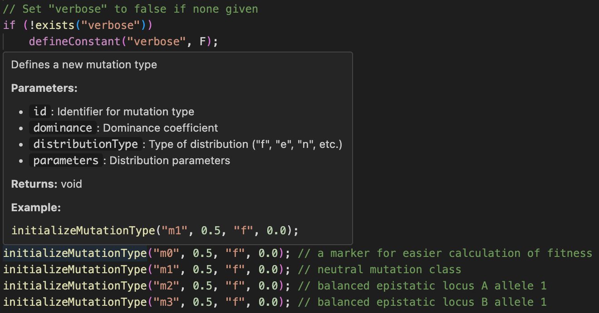

# slim-eidos README

This VSCode extension is built to provide grammar highlighting in Eidos scripts. Eidos is the domain-specific language used within the SLiM framework to simulate the genetics of a population forward-in-time.

## Features

Grammar highlighting includes comments, keywords, etc.

Only .slim files are automatically associated with eidos grammar, as .txt is too broadly used. If you are not seeing grammar highlighting and this is the issue, consider changing .txt files to .slim files, or manually change the language mode by clicking on the button in the bottom right of VS Code and related editors.

Completions, snippets, hover and diagnostic providers coded with the help of Cursor and Claude.

<!-- ## Extension Settings

Include if your extension adds any VS Code settings through the `contributes.configuration` extension point.

For example:

This extension contributes the following settings:

* `myExtension.enable`: Enable/disable this extension.
* `myExtension.thing`: Set to `blah` to do something. -->

## Known Issues

No known issues identified yet.

## Release Notes

Only the primary release has been made available so far.

### 1.0.0

Initial release of the slim-eidos grammar highlighting extension.

---
<!-- 
## Working with Markdown

You can author your README using Visual Studio Code. Here are some useful editor keyboard shortcuts:

* Split the editor (`Cmd+\` on macOS or `Ctrl+\` on Windows and Linux).
* Toggle preview (`Shift+Cmd+V` on macOS or `Shift+Ctrl+V` on Windows and Linux).
* Press `Ctrl+Space` (Windows, Linux, macOS) to see a list of Markdown snippets.

## For more information

* [Visual Studio Code's Markdown Support](http://code.visualstudio.com/docs/languages/markdown)
* [Markdown Syntax Reference](https://help.github.com/articles/markdown-basics/)

**Enjoy!** -->
